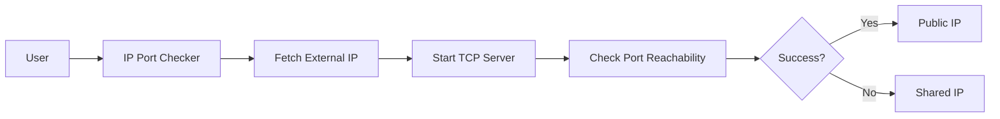

# Real IP Address Checker (Public IP vs. Shared IP)

## Overview

This tool helps you determine if your ISP has provided you with a dedicated public IP address or if you are behind a shared public IP (NATed). It does this by starting a TCP server on a specified port and checking if that port is reachable from the internet.



## Prerequisites
### Port Forwarding
Open a port on your router and forward it to your local machine. This is necessary to check if the port is reachable from the internet. The steps to do this vary depending on your router model, but generally involve the following steps:
- Access your router's admin interface (usually by entering `192.*.*.*` in your browser).
- Find the port forwarding section and add a new rule to forward the desired port to your local machine's IP address.

### Shortcut (Use with Caution): 
You can use DMZ to forward all incoming traffic to your local machine. This is not recommended for security reasons, but it can be useful for testing purposes.

### Special Note for Linux Users:
If you are using a Linux machine, you may need to allow incoming traffic on the specified port using `iptables` or `ufw`. Refer to the documentation for your specific distribution for more information.


## Usage 


### Command-Line Flags

- `-debug`: Enables debug mode, providing additional output for troubleshooting.
- `-port <port>`: Specifies the port number to use for the TCP server. If not specified, a random port (49198) will be used.

### Example Commands

- **Run with a Specific Port**:
  ```bash
  ./real-ip-checker -port 8080
  ```

- **Run in Debug Mode**:
  ```bash
  ./real-ip-checker -debug
  ```

### Sample Output

```plaintext
Fetching your external IP address...
Your external IP address is: 203.0.113.10
Starting a TCP server on port 49198...
TCP server successfully started, listening on port 49198
Checking if port 49198 on IP 203.0.113.10 is reachable from the internet...
Success! Port 49198 on IP 203.0.113.10 is reachable. Your ISP has likely provided you with a dedicated public IP.
```

### Interpretation

- **Success Message**: Indicates that the selected port on your external IP is reachable, suggesting you have a dedicated public IP.
- **Failure Message**: Indicates that the selected port on your external IP is not reachable, suggesting you might have a shared public IP (NATed).

## Troubleshooting

- **Port Already in Use**: If the application fails to start the TCP server, ensure that the specified port is not already in use by another application.
- **Network Restrictions**: If the port is not reachable, it may be blocked by a firewall or NAT configuration by your ISP.


## Contributing

Contributions are welcome! Please fork the repository and submit a pull request with your improvements.

